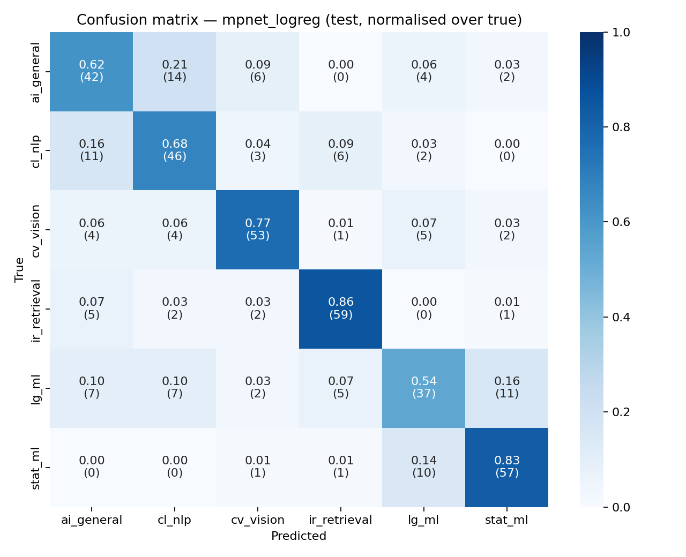

# arxiv-cs-subfield-classifier

Fine-grained classification of arXiv CS abstracts into six overlapping
sub-fields (`cs.CL`, `cs.LG`, `cs.CV`, `cs.IR`, `cs.AI`, `stat.ML`) using
sentence embeddings plus lightweight scikit-learn classifiers. Course project
for the Uppsala University NLP module, Spring 2026.

## Links

- 🤗 **Dataset**: <https://huggingface.co/datasets/Tiansve/arxiv-cs-subfield>
- 🤗 **Model**: <https://huggingface.co/Tiansve/arxiv-subfield-linear-probe>
- 🤗 **Live demo (Gradio Space)**: <https://huggingface.co/spaces/Tiansve/arxiv-subfield-demo>
- 📄 **Report**: [`IR_Classifier_Report.pdf`](IR_Classifier_Report.pdf)

## Results

| config         | val macro-F1 | test acc. | test macro-F1 | test weighted-F1 |
|----------------|-------------:|----------:|--------------:|-----------------:|
| **mpnet_logreg**  | **0.7581** | 0.7136 | 0.7112 | 0.7116 |
| tfidf_logreg   | 0.7499 | **0.7403** | **0.7390** | **0.7394** |
| mpnet_linsvm   | 0.7460 | 0.7233 | 0.7200 | 0.7204 |
| mpnet_mlp      | 0.7444 | 0.7282 | 0.7252 | 0.7256 |
| minilm_logreg  | 0.7356 | 0.7160 | 0.7124 | 0.7125 |
| e5_logreg      | 0.7179 | 0.7063 | 0.7058 | 0.7060 |

`mpnet_logreg` was selected by val macro-F1 and shipped to the HF model repo.
On test the TF-IDF baseline actually beats every embedding configuration —
see the report for the discussion.



## How to reproduce

```powershell
git clone <repo-url>
cd arxiv-cs-subfield-classifier

# Use a Python 3.11 conda env (PyTorch on Windows is happiest there).
# Inside the env:
pip install -r requirements.txt

# 1. Pull arXiv metadata (~30 min due to the 3.5 s API rate limit).
python -m src.fetch_arxiv                 # add --per-category 30 for a smoke test

# 2. Clean, balance, and split into train/val/test parquet files.
python -m src.build_dataset

# 3. Encode the three splits with each embedder (cached to disk).
python -m src.embed --embedder mpnet
python -m src.embed --embedder minilm
python -m src.embed --embedder e5         # or: --embedder all

# 4. Train + evaluate the six configs; writes results/ and data/artifacts/.
python -m src.train_eval

# 5. Optional: push to the Hugging Face Hub (needs `huggingface-cli login`).
python -m src.upload_dataset
python -m src.upload_model
python -m src.upload_space
```

The pipeline is deterministic: all sklearn/numpy calls are seeded with
`random_state=42` (see `src/config.py`).

## Project layout

```
arxiv-cs-subfield-classifier/
├── README.md
├── IR_Classifier_Report.pdf       # 4-page report (see report/ for sources)
├── requirements.txt
├── .gitignore
├── data/                          # raw + processed (gitignored)
│   ├── raw_arxiv.jsonl
│   ├── processed/{train,validation,test}.parquet
│   ├── embeddings/<embedder>/<split>.npy
│   └── artifacts/                 # best_classifier.joblib, label_encoder.joblib, config.json
├── src/
│   ├── config.py                  # constants: categories, paths, HF repo names
│   ├── utils.py                   # seeding, logging, slugify
│   ├── fetch_arxiv.py             # Step 1 — pull raw metadata
│   ├── build_dataset.py           # Step 2 — clean, balance, split
│   ├── embed.py                   # Step 3 — encode + cache embeddings
│   ├── train_eval.py              # Step 4 — train, eval, write results/
│   ├── upload_dataset.py          # Step 5a — push parquet splits to HF
│   ├── upload_model.py            # Step 5b — push classifier + model card
│   └── upload_space.py            # Step 5c — push Gradio app to HF Space
├── results/
│   ├── metrics.csv
│   ├── confusion_matrix.png
│   └── per_class_report.txt
├── space/                         # mirror of what lives in the HF Space repo
│   ├── app.py
│   ├── requirements.txt
│   ├── README.md                  # Space YAML + description
│   └── examples.json
└── report/
    ├── report.tex
    └── refs.bib
```

## Tech stack

- Data: `arxiv` v4 client, `pandas`, `pyarrow`
- Features: `sentence-transformers` (`all-mpnet-base-v2`, `all-MiniLM-L6-v2`,
  `intfloat/e5-base-v2`) and `scikit-learn` TF-IDF
- Models: `scikit-learn` (LogisticRegression, LinearSVC + CalibratedClassifierCV, MLP)
- Demo: `gradio==4.44.1` on a Hugging Face Space (Python 3.11)
- Reproducibility: fixed `random_state=42` everywhere

## Acknowledgements

Thanks to arXiv for free metadata access, the Sentence-Transformers project,
scikit-learn, Gradio, and the Hugging Face Hub for the artefact hosting.
Project scaffolded with the help of Claude Code; see §5 of the report for an
honest accounting of where the AI helped and where it was wrong.

## License

Apache-2.0 for the code and trained artefacts. The training data inherits
arXiv's licensing terms — see the dataset card for details.
